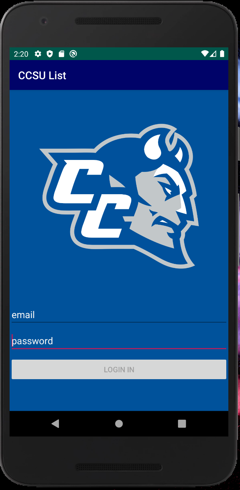
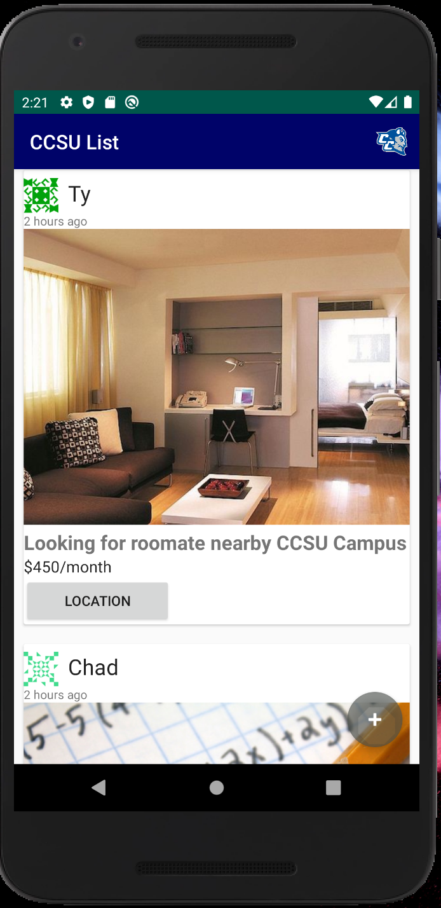

The android application ‘CCSU List’ is college classified mobile app that caters to Central students. Users can post up listings where that ranges from from selling used books, student services, and housing for roommates. The 50 latest listings are populated on the main page of the application. There is an option to get more detail about a listing by clicking on the recycler view on the home page.